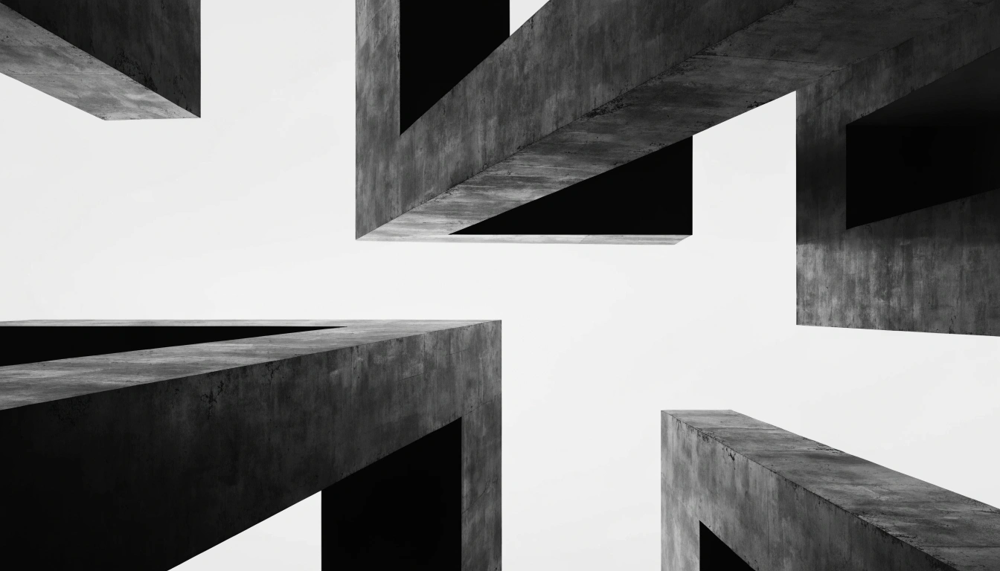

# NOVA — Creative Digital Agency

A premium, high-performance creative agency landing page built with modern web technologies. Featuring smooth scrolling, immersive 3D backgrounds, and sophisticated scroll-triggered animations.



## ✨ Features

- **Smooth Scrolling:** Integrated with Lenis.js for a silky-smooth scrolling experience.
- **GSAP Animations:** Sophisticated scroll-triggered reveals and horizontal scrolling showcases.
- **Three.js Background:** Immersive interactive particle system.
- **Premium Aesthetics:** Clean typography, custom cursor, and minimal design.
- **Fully Responsive:** Optimized for all devices from mobile to desktop.
- **Performance Optimized:** Smooth 60fps animations with optimized asset loading.

## 🛠️ Tech Stack

- **Frontend:** HTML5, Tailwind CSS (via CDN), Vanilla JavaScript
- **Animations:** [GSAP](https://gsap.com/) (ScrollTrigger, ScrollToPlugin)
- **Smooth Scroll:** [Lenis](https://lenis.darkroom.engineering/)
- **3D Graphics:** [Three.js](https://threejs.org/)
- **Typography:** Space Grotesk (Google Fonts)

## 🚀 Getting Started

1. Clone the repository:
   ```bash
   git clone https://github.com/YOUR_USERNAME/nova-agency.git
   ```
2. Open `index.html` in your browser or use a live server.

## 📁 Project Structure

```text
nova-agency/
├── assets/          # Images and visual assets
├── css/             # Custom styling
├── js/              # Animation logic (main-premium.js)
└── index.html       # Main entry point
```

## 📄 License

This project is for demonstration purposes. All rights reserved.

---
Built with ❤️ by NOVA Team
